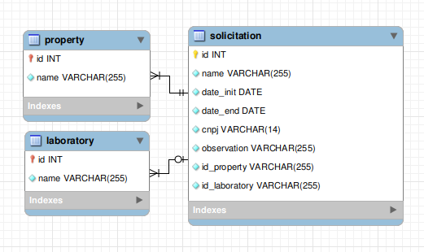
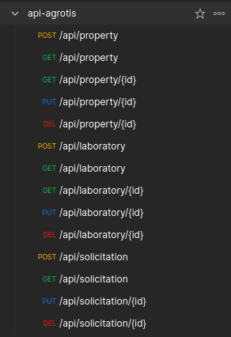
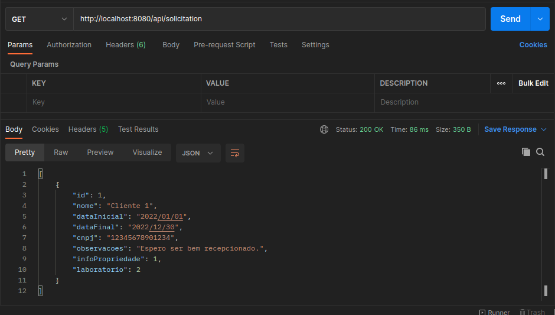
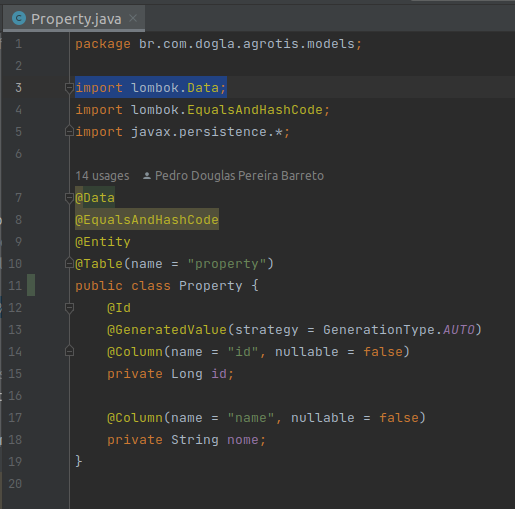
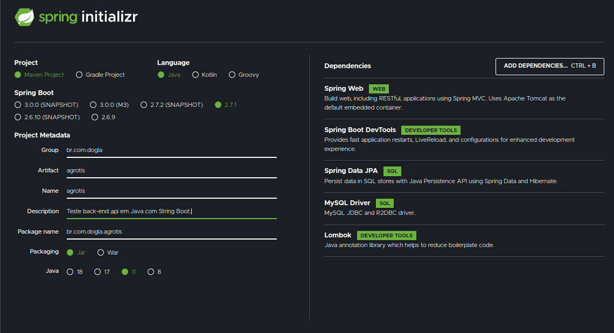

# API - Teste Back-end

## Descrição do projeto
Uma API com metodos **CRUD** e aqruitetura *REST* em Java usando String Boot, gerenciamento de pedidos.
Esta foi minha primeira vez vendo a linguagem: Java, Maven, String Boot, a IDEA IntelliJ e asdf.

## Screenshot
|  |
|-------------------------------------------------------------|
| _Modelo_                                                    |

##  Para iniciar
1. Tenha o Java, Maven e o Postman instalado em sua máquina.
2. Para baixar este projeto via git rode no terminal: `git@github.com:Dogl4/Back-end-teste.git` ou [zip](https://github.com/Dogl4/Back-end-teste/archive/refs/heads/main.zip "Download Zipado | Back-end-teste")
3. Variaveis de ambiente: *environment*

|chave            | valor                                                             |
|-----------------|-------------------------------------------------------------------|
|`APP_URL`        | <mysql://localhost:api-agrotis?serverTimezone=UTC?useSSL=false>   |
|`MYSQL_URL`      | <mysql://localhost:3306/api-agrotis>                              |
|`MYSQL_USER`     | <seu_usuario_mysql>                                               |
|`MYSQL_PASSWORD` | <sua_senha_do_mysql>                                              |
4. Crie a tabela manualmente, no banco mysql: 
```mysql
Create database	`api-agrotis`;
```
5. Use algum dos seguintes programas para fazer a requisição:
- [Postman](https://www.postman.com/) (_recomendo_)
- [Insomnia](https://insomnia.rest/)
- [Thunder Client](https://www.thunderclient.com/)
6. Comandos para quem não usa IDEA própria para java, para iniciar a aplicação.
- Instale as dependencias `mvn install`
- Rode a aplicação na porta: http://localhost:8080 : `mvn spring-boot:run`

## Rotas
Na raiz do projeto tem um arquivo chamado: `api-agrotis.postman_collection.json`, com a collection do postman.
- `/api/property` (POST, GET)
- `/api/property/{id}` (GET, PUT, DELETE)
- `/api/laboratory` (POST, GET)
- `/api/laboratory/{id}`  (GET, PUT, DELETE)
- `/api/solicitation` (POST, GET)
- `/api/solicitation/{id}` (PUT, DEL) (_metodo **PUT** em desenvolvimento_)

|  |  |
|---------------------------------------------------------|---------------------------------------------------------------------|
| _enpoints_                                              | _exemplo_                                                           |
**Obs.:** Projeto em desenvolvimento ainda. Algumas funcionalidades, podem não funcionar corretamente. Relacionamentos entre entidades ainda não implementado.

## Aprendizado
Gostei da linguagem Java, realmente sinônimo de **POO**, tanto os getters, setters e as interfaces, facilitam a programação. Adorei a library Lombok, que faz o mapeamento das propriedades automaticamente, ao inves de fazer manualmente(getters, setters), se bem que a IDEA intelliJ é muito bom para fazer isso(primeira vez usando ela, amei, recomendo para quem for codar em java).
  
|  |
|---------------------------------------------------------------------------------------------|
| _Uma parte do código_                                                                       |

## Refêrencias | Tecnologias utilizadas
- [Java openjdk-11.0.2](https://www.oracle.com/technetwork/java/javase/downloads/jdk11-downloads-5066655.html "Java openjdk-11.0.2")
- [Maven 3.8.5](https://maven.apache.org/download.cgi "Maven 3.8.5")
- [Spring-Boot 2.7.1](https://start.spring.io/ "Spring-Boot 2.7.1")
- [Spring-Web](https://spring.io/projects/spring-web "Spring-Web")
- [Spring-Boot-DevTools](https://spring.io/projects/spring-boot-devtools "Spring-Boot-DevTools")
- [Spring-Data-JPA](https://spring.io/projects/spring-data-jpa "Spring-Data-JPA")
- [MySQL Driver](https://dev.mysql.com/downloads/ "MySQL Driver")
- [Lombok](https://projectlombok.org/features/all "Lombok")
- [IDEA IntelliJ Community Edition](https://www.jetbrains.com/idea/ "IDEA IntelliJ Community Edition")
- [Postman](https://www.postman.com/ "Postman")
- [asdf](https://github.com/asdf-vm/asdf "asdf")

|  |
|-----------------------------------------------------------------------------|
| _Dependencias_                                                              |
